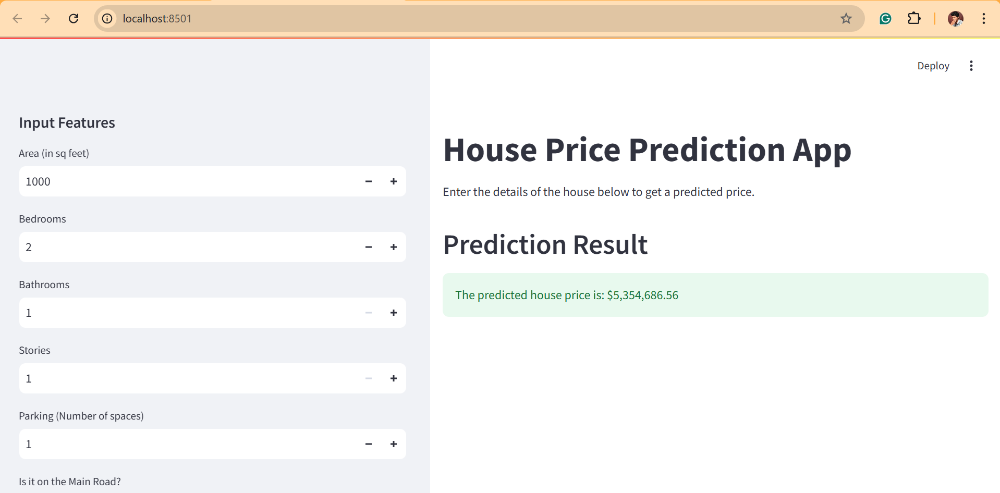

# Housing Price Prediction Using Linear Regression

This project predicts housing prices using linear regression. The model is trained on a housing dataset and estimates property values using features like location, size, and other factors.

---

## Features

- Predict housing prices based on input features.
- Includes data cleaning, EDA, and feature selection.
- Evaluates the model using **RMSE** and **R² Score**.

---

## Tools and Technologies

- **Python Libraries**:
  - Pandas
  - NumPy
  - Matplotlib
  - Seaborn
  - Scikit-learn

---

## Workflow

1. **Data Preprocessing**: Cleaned and prepared the dataset.
2. **EDA**: Explored data patterns and relationships.
3. **Feature Selection**: Identified key features for the model.
4. **Model Training**: Built and trained a **Linear Regression** model.
5. **Evaluation**: Assessed performance using metrics like RMSE and R².

---

## Dataset Features

- Location
- Size (square footage)
- Number of bedrooms
- Number of bathrooms
- Additional relevant features

---

## Results

- **RMSE**: _(1324506)_
- **R² Score**: _(0.85)_

---

## Sample UI

Here’s an example of the application’s interface:

---

## Contact

- **MALLIKARJUN**  
  Data Science
  [GitHub](https://github.com/Mallikarjun-B-Patil) | [LinkedIn](https://www.linkedin.com/in/mallikarjunpatil4472/)
